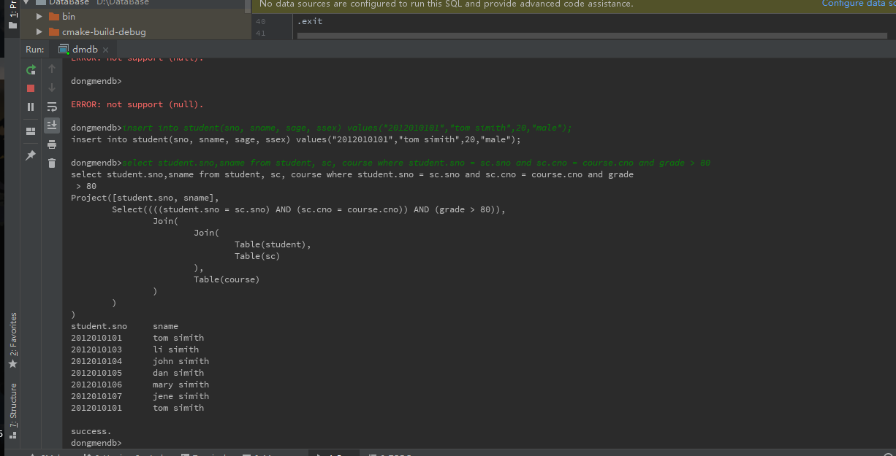

#   实验目的

安装配置开发环境、检出代码并运行

#   实验过程

1.  安装CLion
2.  安装并配置MinGW 5.0
3.  fork [https://github.com/youngsamwei/DongmenDB]()
4.  使用CLion中自带的git工具clone到本地
5.  build
6.  run

运行结果如下

#   实验总结

通过本次实验, 我学会了如何使用CLion, 以及dongmenDB的环境搭建
