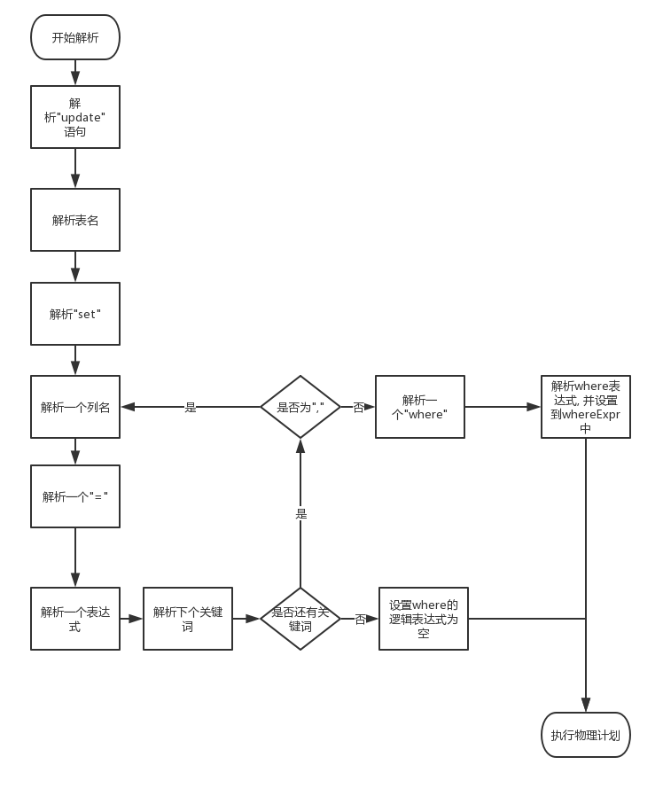
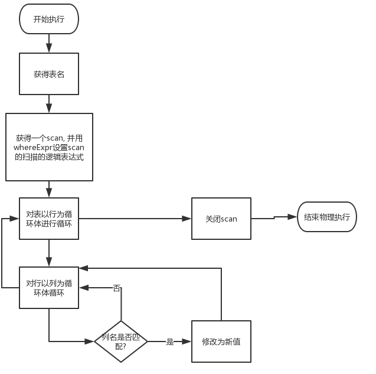

#   算法描述

标准的update语句的格式如下

```sql
update <table_name> set <field1> = <expr1> [, <field2>=<expr2>,...]
where  <logal_expr>;
```
举例

```sql
update  spj
set sno=1, jno=2
where pno=1;
```

解析语句的整体算法就是一句句的匹配关键词以及根据关键词来判断解析的内容.

解析SQL语句之后要做的就是执行物理计划, 执行物理计划以如下方式进行.

解析SQL语句后悔获得如下数据:

1.  被更新的表
2.  待更新的列名
3.  更新后的值
4.  筛选条件(如果有)

故物理执行的整体算法就是循环遍历表的每个满足条件的行, 然后对相应的列值进行修改.

#   流程图

解析的流程图



物理执行的流程图


