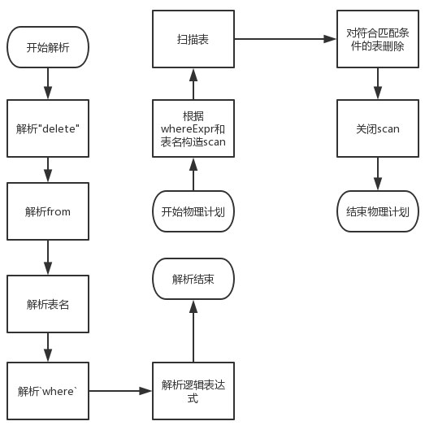

##   算法描述

delete语句的解析执行大体和update相同(其本质类似, 都是修改数据), 故delete语句的解析和物理执行的算法结构大体一致.

标准的delete语句如下

```sql
delete  from    <table_name >
where   <logical_expr>;
```

exp

```sql
delete  from    spj
where   sno=1;
```

解析的大体流程如下

1.  解析'delete', 'from'
2.  解析表名
3.  解析'where', 如果存在
4.  解析逻辑判断表达式

物理执行的大体流程如下

1.  根据表名, whereExpr构造一个scan
2.  扫描整个表, 并将匹配的表删除.
3.  关闭scan

##   流程图

