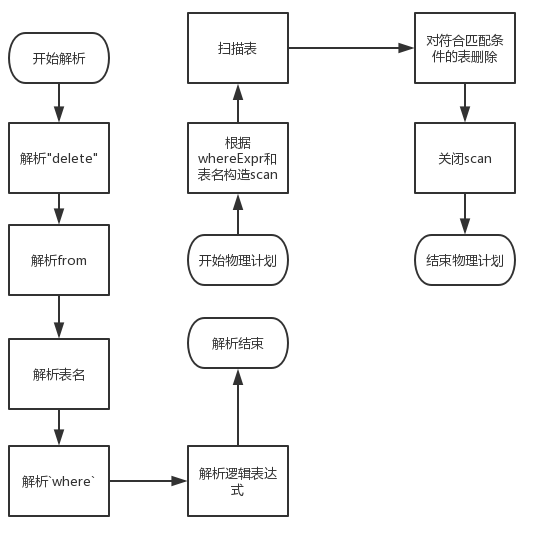

#   实验目的

实现delete语句的解析与执行


#   实验过程

##  实现src_experiment\exp_01_stmt_parser\exp_01_05_delete.cpp中定义的parse_sql_stmt_delete函数，将delete语句解析为内部数据结构

delete语句的语法定义为:

```sql
DELETE <table_name> WHERE <logical_expr>
```

解析的大体流程如下

1.  解析'delete', 'from'
2.  解析表名
3.  解析'where', 如果存在
4.  解析逻辑判断表达式

##  实现src_experiment\exp_07_physical_operate\exp_07_06_delete.cpp定义的plan_execute_delete函数，产生物理计划并执行

物理执行的大体流程如下

1.  根据表名, whereExpr构造一个scan
2.  扫描整个表, 并将匹配的表删除.
3.  关闭scan

##   流程图



#   实验总结

通过本次实验的学习, 我学会了如何解析delete语句, 并进一步熟悉了dongmenDB的各种方法的使用方法.
