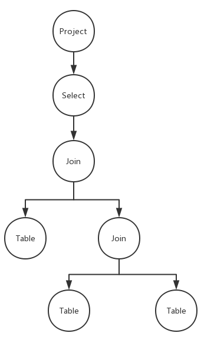

#   实验目的

查询优化

#   实验过程

实现src_experiment\exp_05_algebra_opt\exp_05_02_condition_push_down.c中的dongmengdb_algebra_optimize_condition_pushdown函数。 

由于算法结构相对复杂, 故本次将分模块, 自顶向下的解释整体算法的流程.

### 对外开放的dongmengdb_algebra_optimize_condition_pushdown

该模块是对整个数据库结构开放的, 故相对来说结构比较简洁, 且该部分的代码较为能够代表整体算法的结构.

1.  获取整个语法树种的第一个select节点的表达式, 并预处理该表达式. 处理完后删除该节点.

2.  删除表达式链的所有的前置`AND`,  并将表达式链按头结点来进行分割,    将分割的头结点放到一个容器中(std::vector)

3.  用重写的SRA树重构所有的关系节点

4.  添加所有的表达式的`TOKEN_WORD`类型的结点的表名(把'sno=1'变成's.sno=1')  

4.  调用重构的SRA树的树根节点的pushSRADown方法

5.  重构关系树的首节点

开始的关系节点树如下图所示

### 私有的重构_SRA树

这里使用了面向对象的操作方法, 由于算法时间复杂度并不是很高, 故并没有过多的考虑时间复杂度的问题.

核心内容是expressionMatch函数, 用来进行表达式, 节点匹配判断.

也就是说, 在这里, 如何判断一个表达式是否和当前节点匹配是最大的问题.

对两种不同的类型, Join和Table, 有不同的判断方式.

####join类型的节点:

首先找到那些有两个关键字的表达式, 跳过单个关键字的表达式.(return false)

查找表达式的两个对比的表, 查找当前Join节点下是否有两个表的根节点. 如果不是, 跳过该表达式.(return false)

如果是, 则使用在线Tarjan算法查找这两个根节点的LCA(最近公共祖先)是否为当前节点. 若不是, 跳过该表达式.(return false)

如果是, 那就是了(return true)

####table 类型的节点

找到单个关键字的表达式.

查看该表达式中的关键字的表名是否与当前表名匹配.

如果匹配, 那就是了(return true)

### 重新解析Expression链

1.  删除所有的AND类型的Expression结点

2.  根据头结点(=, >,<,>=,<=,!=等)划分不同的Expression节点, 并存放在一个vector中

结束

#   实验总结

本次实验内容较为复杂, 算法实现较为困难. 在编码过程中遇到了相当多的困难.

首先我学会了如何对一颗关系树进行优化: 在Join节点和table节点之前添加合适的select节点.

而本次实验我比较叛逆的使用了一种非常暴力, 直观的优化方式, 而非直接使用实验指导书中给出的算法方案.

考虑到将来可能进行的对project节点的优化, 并且为了更加直观, 方便未来的代码维护者对算法进行修改维护.
 我重新构造了一个新的树形结构, 用面向对象的思想重新审视整个算法的执行, 递推过程.
 
而对于表达式与节点的匹配, 我使用了著名的在线Tarjan算法.

通过本次实验, 我增进了对dfs算法的熟悉, 了解了先根序表达式节点的物理存储方式. 学会了如何优化一颗算法树.
